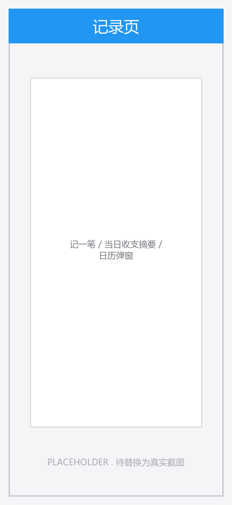
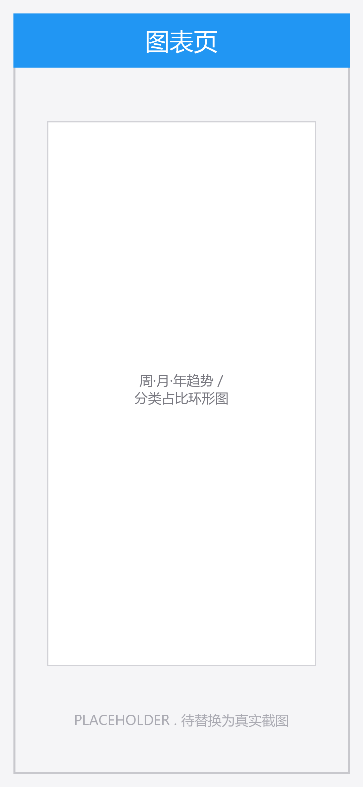
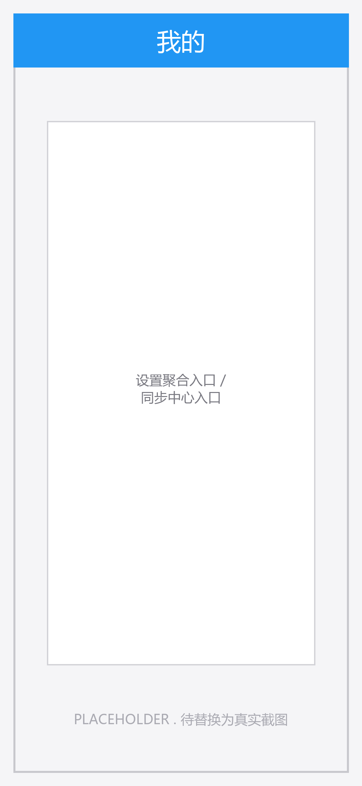
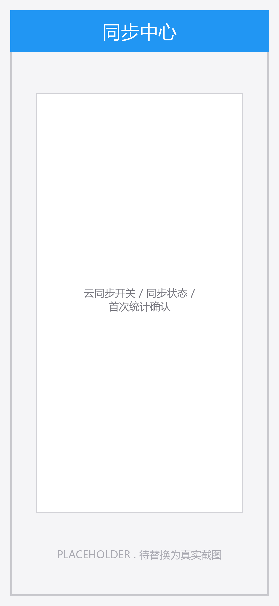
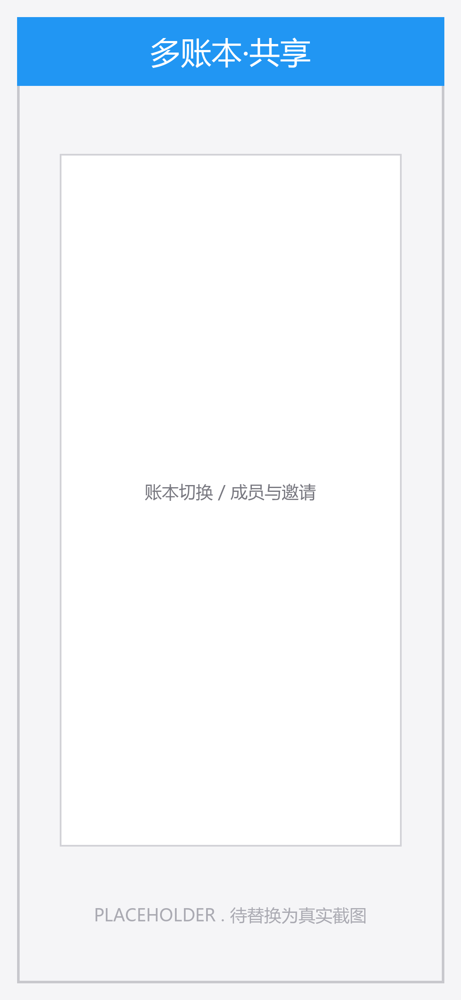

# Android-Minimalist-Bookkeeping
Minimalist Bookkeeping

一款 **本地优先** 的 Android 记账应用：断网也能完整使用核心记账能力，并可选接入家庭自建服务器实现多设备云同步。整体遵循「记 → 看 → 懂 → 控 → 同步」的闭环。

## 功能特性

### 本地记账核心（断网可用）
- **快速记账（记录页）**：支出 / 收入一键记一笔，支持分类、账户、备注、金额；业务日期可切换，带每日收支摘要的日历弹窗取代原生日期选择器。
- **图表分析（图表页）**：按周 / 月 / 年周期浏览，折线趋势图（支出 / 收入 / 结余）与分类占比环形图，直观「看懂」资金流向。
- **我的（聚合入口）**：统一管理分类、账户、周期账单、预算、账本、数据、外观与同步等设置。

### 账户、预算与周期
- **账户与资金流**：多账户管理、账户间转账、余额模型与账户详情；支持账户选择扩展。
- **分类管理**：支出 / 收入分类，内置 emoji 与多种图标，可自定义。
- **周期账单**：设置周期性收支（如房租、工资），到点自动生成账单。
- **预算控制**：总预算 + 按分类设置预算，接近 / 超出预算时提醒。
- **账单退款（V4.0 起）**：编辑账单页右上角 `⋮` → 退款，支持全额与部分退款；退款作为独立流水记录（待到账 / 已到账 / 已撤销），原账单金额不改写，统计与账户余额按净额计算，可查退款记录页。

### 多账本与家庭共享（V3.2 起）
- **多账本体系**：以「账本 Ledger」为业务根节点，支持个人账本、家庭账本、旅行账本等多本账切换。
- **账本级同步与隔离**：同步从「用户级」升级为「账本级」，按账本隔离数据。
- **共享账本**：成员与角色管理、邀请机制，支持家庭 / 室友 / 项目等小型共享场景。

### 搜索、导入导出与数据安全
- **搜索与筛选**：关键词搜索，按日期 / 类型 / 分类 / 账户 / 金额范围筛选历史账单。
- **CSV 导入导出**：批量导入外部账单（含预览与冲突分类），导出本地数据。
- **本地备份 / 恢复**：整机数据备份与恢复（BackupSerializer，JVM 单测覆盖）。
- **回收站（软删除）**：账单 / 分类 / 账户 / 周期均可进入回收站，误删可恢复。
- **删除保护**：删除本地数据需输入管理员账号密码（AdminVerifyStore），编辑账单有保护提示。

### 可选云同步（V3，本地优先不变）
- **账号体系**：邮箱注册 + 邮箱验证 + JWT / Refresh Token 多设备登录。
- **同步中心**：云端同步开关、同步状态、最后同步时间、待同步数量、初次同步数据统计确认页。
- **双向增量同步**：syncId/version/baseVersion 乐观并发 + LWW（最后写入胜出）+ Soft Delete + 冲突日志，覆盖分类 / 账户 / 账单 / 退款 / 预算 / 周期 / 账本 7 类实体；断网 / 关机本地记账照常，恢复后自动续传（指数退避，最长 30 分钟）。
- **设备治理**：设备列表、吊销、退出全部设备。
- **可观测与可运维**：同步诊断、冲突历史、服务器健康检查与备份恢复；管理员入口与版本收尾。

### 体验
- Material 3 设计、深色模式与外观设置；本地优先架构保证无网环境完整可用。


## 截图（占位）

> 以下为**占位图**（纯色框 + 文字），用于预留版式。替换为真实截图时，把 PNG 放到 `docs/screenshots/` 目录并覆盖同名文件即可，说明文字无需改动。建议尺寸 1080×2340（2x）。

| 页面 | 说明 | 预览 |
| --- | --- | --- |
| 记录页 | 记一笔、当日收支摘要、日历弹窗 |  |
| 图表页 | 周/月/年趋势、分类占比环形图 |  |
| 我的 | 设置聚合入口、同步中心入口 |  |
| 同步中心 | 云同步开关、同步状态、首次统计确认 |  |
| 多账本 / 共享 | 账本切换、成员与邀请 |  |

## 技术架构

### 客户端（Android）
- 语言：Java，minSdk 24 / targetSdk 36，版本 `4.0.0`。
- 架构：`Room` + `ViewModel`/`LiveData` + `ViewBinding`，本地数据实时工作；同步层独立于业务层。
- 同步与网络：`Retrofit` + `OkHttp` + `Gson`，后台同步由 `WorkManager` 调度。
- 模块分布：`data`（数据库 / 实体 / 仓库 / 远程）、`domain`（账户 / 预算 / 周期 / 交易 / 导入导出用例）、`ui`（各功能页与适配器）、`sync`（同步协调器 / 队列 / 协议映射）、`util`。

### 服务端（家庭自建，可选）
- 技术栈：Spring Boot 3.5 + PostgreSQL + Flyway + JWT，Docker Compose 部署。
- 部署形态：局域网直连（`http://<家庭电脑IP>:8080`）或公网 HTTPS（Caddy 自动证书）。
- 安全要点：PostgreSQL 仅内网可达、密码 BCrypt、Refresh Token 旋转 + 设备绑定 + 可吊销、认证接口 IP 限流、业务数据按 `userId` 隔离、令牌不落日志。

## 版本演进

- **V1 / V1.1**：本地记账核心闭环（记 → 看 → 懂 → 控），Room + ViewModel/LiveData + Material 3，完全离线可用。
- **V2 / V2.1**：账户与资金管理（转账、余额模型）、分类预算、周期账单、CSV 导入导出、本地备份恢复；V2.1 收尾体验与一致性（周期账单锚点、图表轴、搜索选择器等）。
- **V3**：在保持本地优先的前提下，新增**可选云端同步**——邮箱注册 + 邮箱验证 + JWT/Refresh Token 多设备登录，家庭自建服务器（Spring Boot + PostgreSQL + Docker Compose），syncId/version/baseVersion 乐观并发 + LWW + Soft Delete + 冲突日志的双向增量同步。
- **V3.2**：引入「账本 Ledger」业务根节点，支持多账本、账本级同步与隔离、共享账本与成员/邀请，并增强服务器可运维性（健康检查、备份恢复、Recovery Epoch）。
- **V4（当前）**：账单**退款**——退款以独立流水记录（待到账 / 已到账 / 已撤销），原账单金额不改写，统计与账户余额改按**净额**口径；同步协议 2→3（退款为第 7 类实体）、Room 8→9、本地备份 5→6、服务器备份 formatVersion 2→3、CSV 导出新增退款两列。

## V3 快速开始（云同步）

1. 启动服务器（见 [server/README.md](server/README.md)）：
   ```bash
   cd server && docker compose up -d --build
   ```
2. App 内：我的 → 同步中心 → 填服务器地址（如 `http://<家庭电脑IP>:8080`）。
3. 登录 → 邮箱验证 → 打开「云端同步」开关 → 确认首次同步统计。
4. 服务器关机 / 断网时本地记账完全不受影响；恢复后自动续传（指数退避，最长 30 分钟）。

产品 / 架构基线见 `.qoder/plans/极简记账App_V3_产品设计与开发基线.md`，
开发计划与实施记录见 `.qoder/plans/极简记账_V3_开发计划.md`。

## 构建与测试

```bash
./gradlew assembleDebug            # 客户端 APK
./gradlew testDebugUnitTest        # JVM 单测（216 个）
./gradlew connectedDebugAndroidTest  # 仪器测试（需真机/模拟器，19 个）
cd server && ./gradlew test        # 服务端测试（H2，11 个）
```